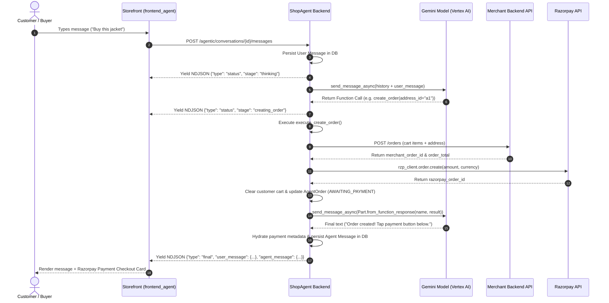

# Agentic Commerce

Complete specification of ShopAgent's agentic commerce engine, detailing how natural-language intent is converted into deterministic e-commerce transactions across the tool-calling loop.

## Related Documentation

- [Architecture](architecture.md)
- [Payment Flow](payment-flow.md)
- [Security & Guardrails](security-and-guardrails.md)
- [Failure Recovery](failure-recovery.md)
- [Merchant Integration](merchant-integration.md)
- [Custom Domains](custom-domains.md)
- [API Reference](api-reference.md)

---

## 1. End-to-End Commerce Transaction Lifecycle

ShopAgent transforms unstructured user chat into structured e-commerce operations through a strict 14-phase pipeline:

```
Natural Language Intent ("I want to buy a black denim jacket")
       ↓
Product Discovery (Gemini calls search_products tool)
       ↓
Product Selection (Backend returns catalog match; UI renders Product Card)
       ↓
Cart Addition (Customer confirms item → add_to_cart tool updates PostgreSQL cart_items)
       ↓
Address Resolution (Customer says "checkout" → agent calls fetch_addresses)
       ↓
Address Matching (resolve_address selects matching address_id or prompts customer)
       ↓
Explicit Customer Confirmation (Customer confirms purchase: "yes", "buy now", "confirm")
       ↓
create_order Dispatch (Agent calls create_order with resolved address_id)
       ↓
Merchant Order Creation (Backend issues POST request to Merchant API endpoint)
       ↓
Razorpay Order Creation (Backend invokes Razorpay SDK to create order)
       ↓
Cart Clearance (PostgreSQL cart_items for customer are cleared)
       ↓
Payment Modal Display (Storefront renders Razorpay Checkout UI card)
       ↓
Payment Execution & Verification (Customer pays → Server verifies HMAC SHA256 signature)
       ↓
Final Order State (AgentOrder status updated to payment_captured → Webhook dispatched)
```

---

## 2. Agent Execution Loop & Tool Orchestration

The agent execution loop is powered by `message_event_stream()` in `app/agentic/llm/orchestrator.py`:



### Iteration Control & Guardrails
- **Max Iteration Limit**: The loop permits up to **4 iterations** per request to prevent infinite function execution cycles.
- **State Streaming**: Real-time progress updates (`thinking`, `searching_products`, `adding_to_cart`, `creating_order`) are yielded continuously over an NDJSON HTTP streaming connection (`application/x-ndjson`).

---

## 3. Tool Reference & Catalog

ShopAgent implements 12 distinct tool functions in `app/agentic/tools/`. Each tool enforces strict parameter validation and backend fallback logic:

| Tool Name | Module | Source of Truth | Primary Purpose | Key Side Effects |
|---|---|---|---|---|
| `search_products` | `products.py` | Merchant API | Catalog search by keyword, category, max price | Hydrates product card metadata in message response |
| `add_to_cart` | `cart.py` | PostgreSQL (`cart_items`) | Adds product or increases item line quantity | Emits `cart_updated` NDJSON event |
| `get_cart_items` | `cart.py` | PostgreSQL (`cart_items`) | Fetches active cart items and subtotal | None (read-only) |
| `update_cart_item` | `cart.py` | PostgreSQL (`cart_items`) | Sets exact item quantity (0 removes item) | Emits `cart_updated` NDJSON event |
| `remove_from_cart` | `cart.py` | PostgreSQL (`cart_items`) | Removes line item from cart | Emits `cart_updated` NDJSON event |
| `fetch_addresses` | `addresses.py` | Merchant API | Retrieves saved delivery addresses | Generates `alias_id` (`a1`, `a2`) and `index_id` |
| `create_address` | `addresses.py` | Merchant API | Saves new delivery address for customer | Appends address to merchant address store |
| `create_order` | `orders.py` | Merchant API + Razorpay | Places order with merchant & creates Razorpay order | Clears cart; creates `AgentOrder` record |
| `retry_payment` | `payment_service.py` | PostgreSQL (`agent_orders`) | Re-initiates Razorpay order for existing order | Recreates `razorpay_order_id` if failed |
| `get_order_history` | `orders.py` | Merchant API | Fetches customer past orders | Hydrates order history cards in metadata |
| `get_customer_profile` | `profile.py` | Merchant API | Fetches customer profile & loyalty status | Hydrates profile cards in metadata |
| `create_conversation_title` | `agent_service.py` | PostgreSQL (`conversations`) | Retitles conversation thread | Emits `title` NDJSON event |

---

### Detailed Tool Specifications

#### 1. `search_products`
- **Inputs**: `query` (string, required), `max_price` (number, optional), `category` (string, optional).
- **Backend Behavior**: Dispatches GET/POST request to `Onboarding.products_config['path']`. Extracts product list using `find_list_in_dict()`.
- **Validation**: Requires `id` and `name` fields via `_pick()`; missing descriptions or thumbnails default gracefully.
- **Failure Behavior**: Returns `{"error": "onboarding_config_not_found", "products": [], "count": 0}` if unconfigured.

#### 2. `add_to_cart`
- **Inputs**: `product_id` (string), `name` (string), `price` (number), `thumbnail_url` (string, optional), `quantity` (int, default 1).
- **Backend Behavior**: Upserts row in `cart_items` scoped to `(merchant_id, customer_email, product_id)`.
- **Validation**: Enforces `MAX_CART_ITEMS` (5 unique items per cart) and `MAX_LINE_QUANTITY` (max 20 per item).
- **Failure Behavior**: Returns `{"error": "cart_full"}` or `{"error": "max_line_quantity_exceeded"}`.

#### 3. `fetch_addresses`
- **Inputs**: None.
- **Backend Behavior**: Queries merchant address endpoint. Parses JSON payload using `extract_addresses()`.
- **Address Resolution Strategy**: Generates aliases (`a1`, `a2`) and maps identifiers using `resolve_address()` across 6 strategies: exact ID, alias ID, digit index, keyword (`default`, `primary`, `home`), city/street text fuzzy match, and single-address fallback.

#### 4. `create_order`
- **Inputs**: `address_id` (string, required).
- **Backend Behavior**:
  1. Validates cart is non-empty.
  2. Unconditionally fetches real customer addresses and resolves `address_id` using `resolve_address()`.
  3. Inserts `AgentOrder` in `INITIATED` status.
  4. Dispatches POST request to merchant order creation API.
  5. Updates `AgentOrder` to `MERCHANT_ORDER_CREATED`.
  6. Invokes Razorpay SDK `order.create(amount, currency, receipt)` with amount in paise.
  7. Updates `AgentOrder` to `AWAITING_PAYMENT`.
  8. Deletes customer items from `cart_items`.
- **Mandatory Tool Execution Rule**: The system prompt explicitly forces Gemini to call `create_order` to perform checkout. Outputting plain text claiming "Order placed" without tool execution is strictly prohibited.

#### 5. `retry_payment`
- **Inputs**: `agent_order_id` (string, optional).
- **Backend Behavior**: Looks up existing `AgentOrder`. If status is `PAYMENT_CAPTURED`, returns `already_completed`. If `AWAITING_PAYMENT` with valid `razorpay_order_id`, returns existing metadata. If `FAILED`, creates a new Razorpay order without recreating the merchant order.

---

## 4. Merchant Context & Session Resolution

1. **Host Header Resolution**: When a request hits `/agentic/...`, `resolve_merchant_by_host` inspects `Host`, `X-Forwarded-Host`, `Origin`, or `Referer` headers and looks up matching `DomainMapping` or `Onboarding.base_url` rows in PostgreSQL.
2. **Session Scoping**: All tool executions receive `session` containing `merchant_id` and `customer_ref`. PostgreSQL queries enforce `merchant_id == session["merchant_id"]` and `customer_email == session["customer_ref"]`.

---

## 5. Conversation Persistence & Context Injection

- **Persistence**: Messages are stored in `conversation_messages` with `sender` set to `user` or `agent`.
- **History Hydration**: Before calling Gemini, past messages for the conversation are retrieved from PostgreSQL, converted into Vertex AI `Content(role, parts)` objects, and passed into `model.start_chat(history=history)`.
- **Metadata Hydration**: Historical payment cards rendered in chat are passed through `hydrate_payment_metadata()`, ensuring past messages reflect current payment status (`PAYMENT_CAPTURED`) rather than stale initiation states.

---

## 6. Streaming & NDJSON Event Schema

Responses from `POST /agentic/conversations/{id}/messages` stream newline-delimited JSON (`application/x-ndjson`):

```json
{"type": "status", "stage": "thinking", "label": "Thinking…"}
{"type": "title", "title": "Black Denim Jacket Order"}
{"type": "status", "stage": "searching_products", "label": "Searching products…"}
{"type": "cart_updated", "items": [...], "count": 1, "subtotal": 2499.00}
{"type": "status", "stage": "final_touches", "label": "Putting it together…"}
{"type": "final", "user_message": {...}, "agent_message": {...}}
```
