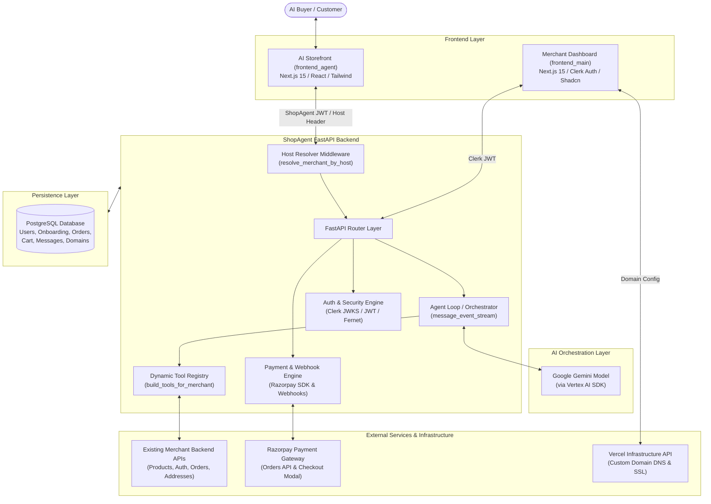
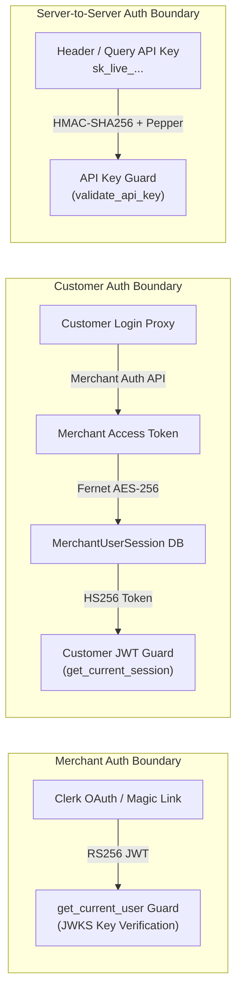
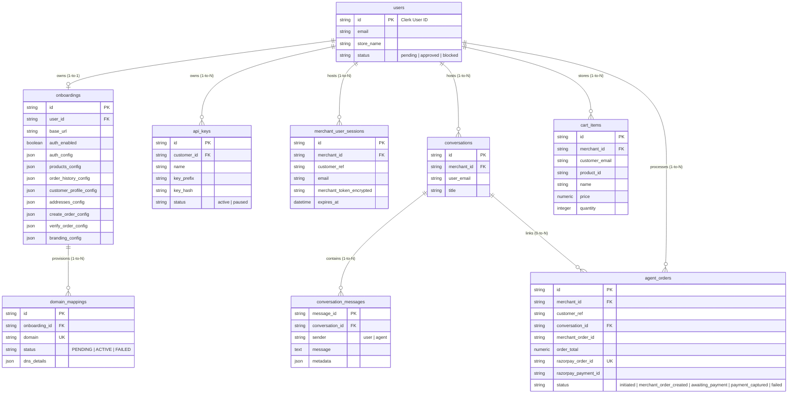
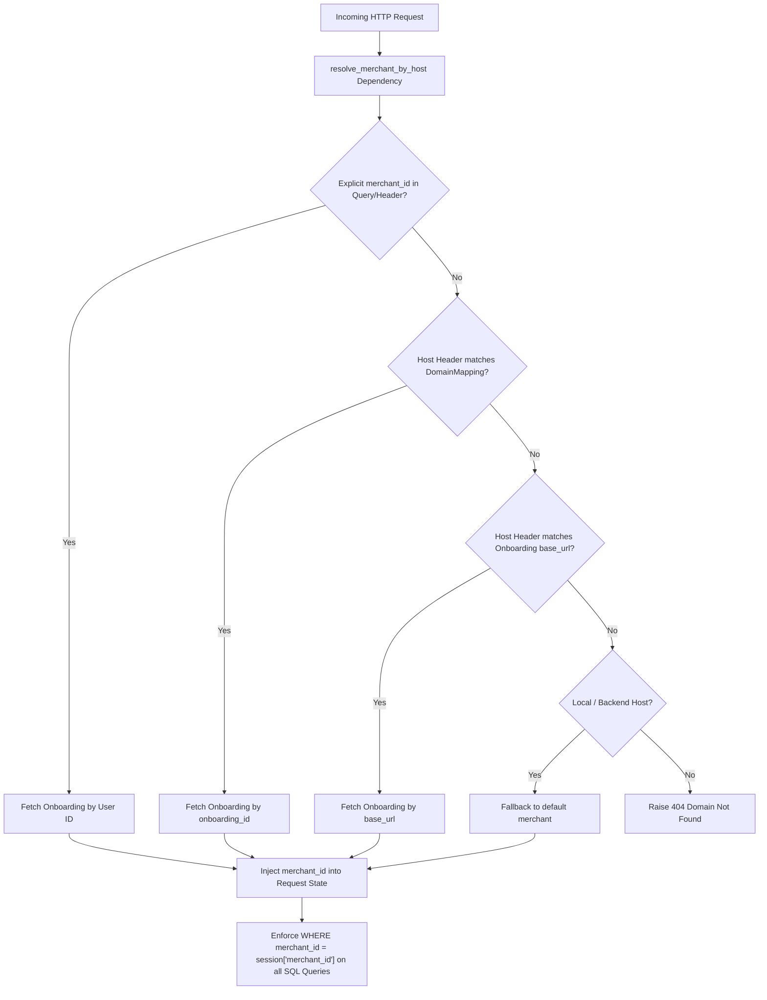

# Architecture

Comprehensive architectural blueprint of ShopAgent, detailing component responsibilities, state ownership, authentication boundaries, multi-tenancy, database entity relationships, and key design tradeoffs.

## Related Documentation

- [Agentic Commerce](agentic-commerce.md)
- [Payment Flow](payment-flow.md)
- [Security & Guardrails](security-and-guardrails.md)
- [Failure Recovery](failure-recovery.md)
- [Merchant Integration](merchant-integration.md)
- [Custom Domains](custom-domains.md)
- [API Reference](api-reference.md)

---

## 1. System Overview & Purpose

**ShopAgent** is an AI-native conversational commerce engine that converts traditional merchant HTTP APIs into an interactive, LLM-powered storefront. Instead of forcing merchants to rebuild their inventory, cart, or order management backends, ShopAgent acts as an adaptive orchestration middleware. It translates natural language customer intent into deterministic tool executions against existing merchant APIs, manages session and cart state in PostgreSQL, and completes financial transactions securely via Razorpay.

---

## 2. Core Components & Responsibilities

### 2.1 Frontends

#### `frontend_agent` (AI Storefront)
- **Role**: Lightweight customer-facing conversational interface built with Next.js 15.
- **Responsibilities**:
  - Renders real-time chat UI with streaming status indicators (`thinking`, `searching_products`, `processing_checkout`).
  - Displays dynamic UI cards for product search results, cart items, saved delivery addresses, order history, and account profiles.
  - Hosts the embedded Razorpay Checkout modal for one-click payment execution.
  - Obtains merchant branding context dynamically via host header resolution (`/api/public/branding`).

#### `frontend_main` (Merchant Dashboard)
- **Role**: Administrative web application for merchants.
- **Responsibilities**:
  - Authenticates merchants via Clerk (OAuth & Email magic links).
  - Guides merchants through API endpoint mapping (Auth, Catalog, Cart, Addresses, Orders).
  - Manages API Keys (`sk_live_...`) with permission scoping and pause/resume capabilities.
  - Provisions custom domains via Vercel DNS integration.
  - Displays live analytics (Revenue, Orders, Average Cart Value, Activity Feed).

---

### 2.2 Security & Authentication Boundaries

ShopAgent enforces distinct security models across different user types and integration touchpoints:

---

### 2.3 Backend & AI Layer

#### FastAPI Backend (`backend/app`)
- **Role**: High-performance asynchronous Python backend serving as the central engine.
- **Responsibilities**:
  - Enforces multi-tenant isolation, route validation, session state management, and cryptography.
  - Bridges agent tool execution with external merchant HTTP endpoints.
  - Manages Razorpay order generation, HMAC SHA256 signature verification, and automated webhook dispatches.

#### Agent / LLM Orchestrator (`app/agentic/llm/orchestrator.py`)
- **Role**: Event-driven streaming orchestrator managing conversation execution loops.
- **Responsibilities**:
  - Manages the Vertex AI / Gemini SDK chat instance.
  - Injects conversation history and system instructions tailored with the merchant's store name.
  - Executes function calls returned by Gemini, enforces a maximum loop iteration guardrail (max 4 iterations), and streams NDJSON events back to the client.

#### Tool-Calling Architecture (`app/agentic/llm/tools.py`)
- **Role**: Schema registry for function declarations exposed to Gemini.
- **Responsibilities**:
  - Dynamically builds available tool schemas based on the merchant's active `Onboarding` features (e.g., omitting `create_address` if address creation isn't supported by the merchant backend).
  - Translates model intent into structured parameters validated by tool handler modules (`products.py`, `cart.py`, `addresses.py`, `orders.py`, `profile.py`).

---

### 2.4 Database Entity-Relationship (ER) Architecture

The PostgreSQL relational schema is structured to maintain strict tenant separation and full transaction history:

---

### 2.5 External Services & Infrastructure

#### Merchant APIs
- **Role**: Existing e-commerce backends owned by merchants.
- **Responsibilities**:
  - Acts as the ultimate source of truth for product availability, customer account credentials, saved delivery addresses, and primary merchant order creation.

#### Razorpay Payment Gateway
- **Role**: External financial infrastructure handling order generation, customer checkout UI, and signature verification.

---

## 3. Ownership & Responsibility Matrix

To prevent ambiguity, responsibilities across component boundaries are explicitly separated:

| Component / Layer | Responsible For | NOT Responsible For |
|---|---|---|
| **AI Reasoning (Gemini)** | Natural language parsing, intent recognition, selecting appropriate tool calls, conversational response generation. | Money movement authorization, price calculations, database mutations, direct payment state toggling. |
| **Deterministic Backend (ShopAgent)** | Price validation, cart line calculations, database state persistence, signature verification, API key hashing, host resolution, session encryption. | Inventing product details, overriding merchant inventory rules, executing unverified payment claims. |
| **Merchant Source-of-Truth** | Real product catalog data, customer authentication validity, primary merchant order creation, delivery address validation. | Conversational state, Razorpay checkout modal rendering, agent message streaming. |
| **Payment Source-of-Truth (Razorpay)** | Customer card/UPI charge processing, generating cryptographically signed payment signatures. | Local cart management, conversational context, merchant API configuration. |
| **ShopAgent Internal State** | Scoped `AgentOrder` lifecycle tracking (`initiated` → `payment_captured`), cart items state, conversation thread indexing. | Merchant inventory reservation outside created orders, global user password storage. |

---

## 4. Multi-Tenancy & Session Scoping

ShopAgent provides multi-tenant isolation out of the box:

1. **Host-Based Merchant Resolution**: `resolve_merchant_by_host` inspects incoming request HTTP headers (`Host`, `X-Forwarded-Host`, `Origin`, `Referer`) or explicit `merchant_id` query parameters, matching them against `DomainMapping` records and `Onboarding.base_url`.
2. **Customer Session Scoping**: Upon customer login via `/api/public/auth/login`, ShopAgent generates a scoped JWT containing `sub` (Session ID), `merchant_id`, and `customer_ref`.
3. **Database Level Isolation**: All queries against `cart_items`, `agent_orders`, `conversations`, and `merchant_user_sessions` enforce explicit SQL filtering on `merchant_id`.

---

## 5. Key Architectural Decisions & Tradeoffs

### Decision 1: Adaptation Layer vs. Backend Rebuild
- **Approach**: ShopAgent maps existing merchant REST endpoints using configurable JSON field paths (`products_config`, `create_order_config`, `addresses_config`) rather than requiring a dedicated plugin or database migration.
- **Tradeoff**: Increases backend complexity in handling dynamic JSON extractions (`extract_by_path`, `find_list_in_dict`), but reduces merchant onboarding time to minutes with zero backend codebase modifications.

### Decision 2: Hybrid Database + API Cart Management
- **Approach**: Shopping carts are maintained natively in ShopAgent's PostgreSQL database (`cart_items`), while product catalog searches and order creations are routed live to the merchant API.
- **Tradeoff**: Requires live price re-verification during `create_order`, but prevents excessive HTTP roundtrips to merchant backends during casual chat browsing.

### Decision 3: Deterministic Tool Execution Guardrails
- **Approach**: The system instruction explicitly forbids Gemini from textually claiming an order is placed or payment is captured without successfully dispatching the `create_order` or `retry_payment` function calls.
- **Tradeoff**: Increases strictness in prompt formatting, but eliminates AI hallucination vulnerabilities where a model falsely informs a customer that their card was charged.

### Decision 4: Asynchronous Server-Side Signature Verification
- **Approach**: Razorpay payment success is never trusted based on client-side JS callbacks alone. The storefront submits `razorpay_order_id`, `razorpay_payment_id`, and `razorpay_signature` to `/agentic/payments/verify`, where server-side HMAC SHA256 verification is performed before updating `AgentOrder.status` to `payment_captured`.
- **Tradeoff**: Requires an extra API call after Razorpay modal dismissal, but guarantees 100% transaction integrity against client spoofing.
