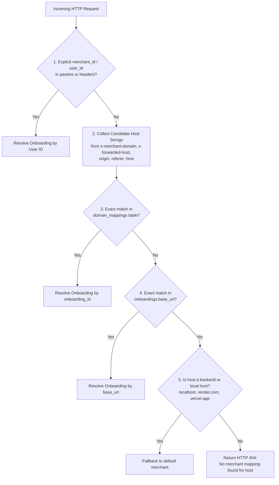

# Custom Domains

Technical specification of ShopAgent's multi-tenant custom domain architecture, Vercel DNS integration, host resolution pipeline, and SSL provisioning.

## Related Documentation

- [Architecture](architecture.md)
- [Agentic Commerce](agentic-commerce.md)
- [Payment Flow](payment-flow.md)
- [Security & Guardrails](security-and-guardrails.md)
- [Failure Recovery](failure-recovery.md)
- [Merchant Integration](merchant-integration.md)
- [API Reference](api-reference.md)

---

## 1. Domain Architecture Overview

ShopAgent enables merchants to serve their AI Storefront directly on their own brand domain (e.g., `agent.merchantstore.com` or `shop.brand.in`). 

The domain system consists of three integration layers:

1. **Merchant Dashboard Domain Management** (`frontend_main`): Merchants register, view DNS configuration instructions, trigger verification, or remove domains.
2. **Vercel Infrastructure Integration** (`app/services/vercel.py`): Automatically provisions custom domains on the Vercel Edge Network via the Vercel REST API.
3. **Host-Based Resolution Dependency** (`app/agentic/dependencies.py`): Intercepts incoming HTTP requests to resolve the target merchant tenant before routing to the AI agent.

---

## 2. Host Resolution Priority Chain

Every incoming request to public storefront routes (`/api/public/branding`, `/agentic/conversations`, etc.) passes through `resolve_merchant_by_host()`. The dependency evaluates candidate domains using a strict 5-stage priority chain:



### Candidate Extraction (`extract_host_variants`)
The resolver extracts clean hostname variants by stripping protocols (`https://`), paths, and port numbers (e.g., `agent.mystore.com:3000` → `agent.mystore.com`).

---

## 3. Database Model & Relationships

Custom domains are stored in the `domain_mappings` PostgreSQL table (`app/system/models.py`):

```
┌─────────────────────────────────────────────────────────────┐
│                       Onboarding                            │
│  id: "550e8400-e29b-41d4-a716-446655440000" (Primary Key)   │
│  user_id: "user_2ab..." (Clerk User ID)                     │
└──────────────────────────────┬──────────────────────────────┘
                               │ 1-to-N Relationship
                               ▼
┌─────────────────────────────────────────────────────────────┐
│                      DomainMapping                          │
│  id: "a1b2c3d4-..." (Primary Key)                           │
│  onboarding_id: "550e8400-..." (Foreign Key -> onboardings) │
│  domain: "agent.mystore.com" (Unique Index)                 │
│  status: "PENDING" | "ACTIVE" | "FAILED"                     │
│  dns_details: JSON (CNAME target, recommended IPv4, TXT)    │
└─────────────────────────────────────────────────────────────┘
```

---

## 4. Vercel Infrastructure Integration & Lifecycle

Domain provisioning communicates with the Vercel API (`app/services/vercel.py`):

### Step 1: Registration (`POST /onboarding/domains`)
1. Normalizes and validates the domain string against `DOMAIN_REGEX`.
2. Checks for local PostgreSQL uniqueness.
3. Invokes `add_domain_to_vercel(domain)`.
4. Extracts CNAME targets (`cname_target`, e.g. `cname.vercel-dns.com` or recommended CNAME).
5. Creates a `DomainMapping` record with status `PENDING`.

### Step 2: DNS Configuration
The merchant adds the recommended DNS record at their DNS provider (Cloudflare, GoDaddy, Namecheap):

| Record Type | Host / Name | Value / Target |
|---|---|---|
| **CNAME** (Subdomain) | `agent` | `cname.vercel-dns.com` |
| **A Record** (Apex) | `@` | `76.76.21.21` |

### Step 3: Verification (`POST /onboarding/domains/{id}/verify`)
1. Calls `verify_domain_on_vercel(domain)`.
2. Inspects `dns_details.misconfigured` and `verified` fields returned by Vercel.
3. If verified, updates local status to `ACTIVE`. If misconfigured, status remains `PENDING`.

### Step 4: SSL Certificate Provisioning
SSL certificates are **automatically issued and renewed** by Vercel Edge Network via Let's Encrypt as soon as DNS verification passes. No custom certificate uploading or server configuration is required.

### Step 5: Deletion (`DELETE /onboarding/domains/{id}`)
1. Invokes `delete_domain_from_vercel(domain)`.
2. Deletes the local `DomainMapping` PostgreSQL row.

---

## 5. Unmapped Domain Behavior & Public Branding

- **Unmapped Domain Request**: If a request arrives with a `Host` header that is not registered in `domain_mappings` or `onboardings.base_url`, `resolve_merchant_by_host` raises an `HTTP 404 Not Found` with detail: `"No merchant mapping found for host: <unmapped-domain>"`.
- **Public Branding Endpoint** (`GET /api/public/branding`): Uses `resolve_merchant_by_host` to resolve the current merchant tenant without requiring customer authentication, returning the merchant's store name, logo URL, and brand color palette.

---

## 6. Removed Legacy Behavior Note

> [!NOTE]
> In earlier development iterations, ShopAgent supported slug-based domain paths (e.g. `/store/:slug`). In commit `d60e1f8`, slug columns (`slug`) were officially purged from `onboardings` and `domain_mappings` tables in favor of 100% host-based multi-tenancy and custom domain mapping.
