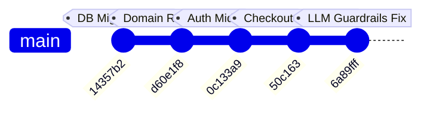

# Failure Recovery

Comprehensive technical guide to failure handling, error mitigation, payment retry flows, intentional anti-patterns, and real development incident analysis in ShopAgent.

## Related Documentation

- [Architecture](architecture.md)
- [Agentic Commerce](agentic-commerce.md)
- [Payment Flow](payment-flow.md)
- [Security & Guardrails](security-and-guardrails.md)
- [Merchant Integration](merchant-integration.md)
- [Custom Domains](custom-domains.md)
- [API Reference](api-reference.md)

---

## 1. Primary Recovery Scenario: Payment Failure & Retry

The most critical transaction failure scenario occurs when a customer's payment fails or is abandoned after an order has already been created on the merchant backend.

```
┌─────────────────────────────────────────────────────────────────────────┐
│                     PAYMENT FAILURE & RETRY FLOW                        │
├─────────────────────────────────────────────────────────────────────────┤
│ 1. Customer initiates checkout → create_order executes                  │
│ 2. Merchant Order created on Merchant Backend (e.g. merchant_order_id) │
│ 3. Razorpay Order 1 created (razorpay_order_id_1)                       │
│ 4. Customer payment fails or modal is closed                            │
│ 5. AgentOrder.status set to FAILED / AWAITING_PAYMENT                   │
│                                                                         │
│                           CUSTOMER RETRIES                              │
│                                  ↓                                      │
│ 6. Customer says "Retry payment" or clicks Retry button                 │
│ 7. Gemini dispatches retry_payment(agent_order_id)                      │
│ 8. Backend identifies existing AgentOrder and REUSES merchant_order_id  │
│ 9. Backend creates Razorpay Order 2 (razorpay_order_id_2)               │
│ 10. Customer completes payment → Server verifies HMAC signature         │
│ 11. AgentOrder.status updated to PAYMENT_CAPTURED                       │
└─────────────────────────────────────────────────────────────────────────┘
```

### Why This Prevents Duplicate Merchant Orders
If the system blindly re-executed `create_order` upon payment failure, a second order would be created on the merchant's backend, reserving double inventory and creating duplicate invoice records. `execute_retry_payment()` in `app/agentic/services/payment_service.py` explicitly looks up the existing `AgentOrder` row and **reuses the existing `merchant_order_id`**, ensuring **zero duplicate merchant orders**.

---

## 2. Handled Failure Modes Matrix

| Failure Scenario | Trigger | System Behavior | Customer-Visible Behavior | Data Consistency | Recovery Path |
|---|---|---|---|---|---|
| **Invalid Payment Signature** | Client posts fake/altered signature to `/payments/verify` | HMAC SHA256 mismatch detected; HTTP 400 thrown; transaction logged | Displays error message: "Signature verification failed" | `AgentOrder.status` remains `AWAITING_PAYMENT` | Real payment required via Razorpay Checkout modal |
| **Payment Modal Dismissal** | Customer closes Razorpay popup without paying | `AgentOrder.status` remains `AWAITING_PAYMENT` | Pay button remains active in chat | Cart is cleared (order exists); `AgentOrder` tracks pending state | Customer clicks "Pay Now" or asks agent to retry payment |
| **Retry After Captured Payment** | Customer asks to pay again for an already paid order | `retry_payment` checks `status == "payment_captured"` | Displays message: "Payment for this order has already been completed." | No DB mutation; returns `already_completed` | None needed (idempotent safeguard) |
| **Merchant API Outage / Timeout** | Merchant API returns 5xx or times out during `create_order` | `AgentOrder.status` updated to `FAILED` with `failure_reason` | Displays error message: "Failed to connect to store checkout. Your cart remains intact." | `cart_items` in PostgreSQL are **NOT cleared** | Customer can retry checkout once merchant API recovers |
| **Address Mismatch / Invalid Address** | Customer specifies alias or label not matching saved addresses | `create_order` rejects execution before calling merchant API | Displays saved address list and asks customer to select one | No order created; cart remains intact | Customer selects valid address (`"a1"`, `"default"`) |
| **Stale Payment Cards in Chat** | Customer views historical messages after completing payment | `hydrate_payment_metadata()` dynamically overrides metadata from DB | Chat history shows green "Payment Captured" state | UI cards reflect authoritative DB status | Automatic on message fetch |

---

## 3. What We Intentionally Do Not Do

To maintain system integrity, ShopAgent enforces three strict architectural prohibitions:

1. **Do Not Claim Payment Captured Without Server-Side Verification**: The system prompt explicitly forbids Gemini from informing the customer that an order is paid or captured based on chat context alone. Payment capture is exclusively declared after server-side HMAC SHA256 signature verification in `/agentic/payments/verify`.
2. **Do Not Recreate Merchant Orders for Payment Retries**: `retry_payment` never invokes the merchant's `create_order` API endpoint a second time. It operates strictly against the existing `AgentOrder` and `merchant_order_id`.
3. **Do Not Let the Model Independently Authorize Money Movement**: The LLM cannot directly trigger financial transfers. It can only emit a `create_order` tool call, which generates an uncaptured Razorpay order requiring explicit customer interaction in the Razorpay SDK checkout modal.

---

## 4. What Broke During Development (Git Evidence)

Analysis of the repository commit history reveals real issues encountered and resolved during development:



### Incident 1: LLM Hallucination of Order Placement (`6a89fff`)
- **Symptom**: Gemini would occasionally respond with text saying *"Your order has been placed successfully!"* without actually outputting the `create_order` function call. As a result, no `AgentOrder` was created and no Razorpay payment button was rendered.
- **Root Cause**: Unconstrained system prompt allowed the model to assume conversational completion.
- **Fix**: Added **Mandatory Tool Execution Rule** in `app/agentic/llm/prompts.py`, explicitly forcing function call dispatch and prohibiting fake payment captured text.

### Incident 2: Checkout Stalling at Address Selection (`50c163`)
- **Symptom**: When a customer said *"Checkout"*, the agent would stall by asking *"Which address would you like to use?"* even when saved addresses were already available.
- **Root Cause**: Multi-step turn-taking created unnecessary chat friction.
- **Fix**: Updated orchestrator to automatically invoke `fetch_addresses` and immediately dispatch `create_order` using the default address (`a1` / `is_default: true`) in a single turn.

### Incident 3: Auth Middleware Blocking Server-to-Server Order Verification (`0c133a9`)
- **Symptom**: Merchants attempting to call `GET /merchant/orders/verify` using their API Key received `401 Unauthorized` HTML responses from Clerk auth middleware.
- **Root Cause**: Clerk authentication middleware was mounted globally, intercepting `/merchant/*` routes.
- **Fix**: Excluded `/merchant/*` from Clerk JWT middleware and routed authentication through `validate_api_key` dependency.

### Incident 4: Legacy Domain Mapping Terminology Leakage (`d60e1f8`)
- **Symptom**: Unmapped custom domains fell back to hardcoded legacy Ponion URLs, causing domain resolution errors on 404 screens.
- **Root Cause**: Leftover fallback logic from early prototype iterations.
- **Fix**: Purged legacy references, standardized fallback backend URLs to `shopagent-backend.vijstack.com`, and introduced a clean 404 error page.

### Incident 5: Database Migration Schema Drift (`14357b2`)
- **Symptom**: Newly added columns (`onboardings.id`, `verify_order_config`, `webhook_path`) failed to auto-create on existing Postgres instances.
- **Root Cause**: Alembic migration versions diverged from runtime `Base.metadata.create_all()`.
- **Fix**: Created `run_migrations.py` helper script and startup schema verification checks in `app/main.py`.
