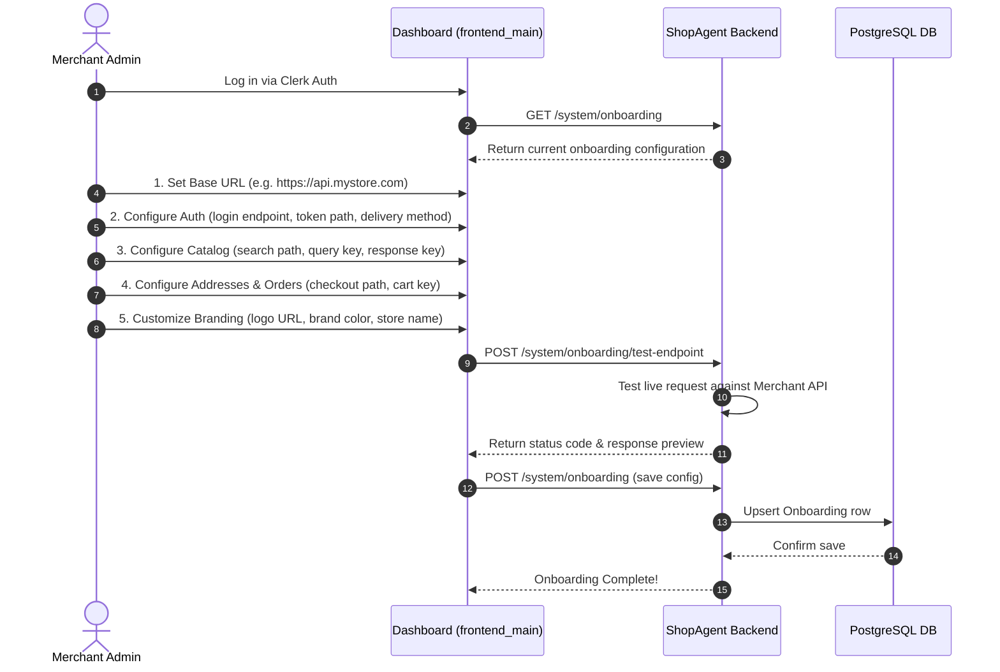

# Merchant Integration

Technical guide to ShopAgent's zero-rebuild merchant onboarding model, JSON API mapping configuration, dynamic token delivery, and multi-tenant scaling.

## Related Documentation

- [Architecture](architecture.md)
- [Agentic Commerce](agentic-commerce.md)
- [Payment Flow](payment-flow.md)
- [Security & Guardrails](security-and-guardrails.md)
- [Failure Recovery](failure-recovery.md)
- [Custom Domains](custom-domains.md)
- [API Reference](api-reference.md)

---

## 1. Core Differentiator: Zero-Rebuild Architecture

The fundamental innovation of ShopAgent is that **a merchant never needs to rebuild or alter their e-commerce backend**. Traditional AI plugins require merchants to install custom SDKs, export database dumps, or adopt proprietary API schemas. 

ShopAgent inverts this paradigm through a **declarative API mapping layer**:

```
┌─────────────────────────────────────────────────────────────────────────┐
│                      SHOPAGENT INTEGRATION FLOW                         │
├─────────────────────────────────────────────────────────────────────────┤
│ [Existing Merchant Backend APIs] (Custom REST Endpoints)                 │
│                 ▲                                                       │
│                 │ (Dynamic HTTP Calls via call_merchant_api)            │
│ [Merchant API Configuration] (Stored in Onboarding PostgreSQL Model)    │
│                 ▲                                                       │
│                 │ (Configures Tool Parameters & Payload Mappings)       │
│ [ShopAgent Tool Layer] (products.py, cart.py, addresses.py, orders.py)  │
│                 ▲                                                       │
│                 │ (Dispatched via Gemini Function Declarations)         │
│ [AI Agent Orchestrator] (Vertex AI / Gemini 2.5/3.6)                   │
│                 ▲                                                       │
│                 │ (Interactive Streaming Conversational Interface)      │
│ [AI-Native Storefront] (Custom Domain / Embedded Chat)                  │
└─────────────────────────────────────────────────────────────────────────┘
```

Merchants simply configure their existing REST endpoint URLs and field names in the Merchant Dashboard (`frontend_main`). ShopAgent handles authentication proxying, parameter translation, response parsing, and error fallback dynamically.

---

## 2. Merchant Onboarding Workflow



---

## 3. Merchant API Configuration Schema

All API mappings for a merchant are stored in the `onboardings` PostgreSQL table (`app/system/models.py`) under dedicated JSON columns:

### 3.1 Authentication Configuration (`auth_config`)
```json
{
  "path": "/api/v1/auth/login",
  "method": "POST",
  "identifier_field": "email",
  "password_field": "password",
  "token_path": "data.token",
  "token_delivery": {
    "method": "header",
    "header_name": "Authorization",
    "bearer_prefix": true
  }
}
```

### 3.2 Product Search Configuration (`products_config`)
```json
{
  "path": "/api/v1/products/search",
  "method": "GET",
  "payload_key": "query",
  "response_key": "products"
}
```

### 3.3 Delivery Address Configuration (`addresses_config`)
```json
{
  "fetch": {
    "path": "/api/v1/user/addresses",
    "method": "GET",
    "response_key": "addresses",
    "id_field": "address_id"
  },
  "create": {
    "path": "/api/v1/user/addresses",
    "method": "POST",
    "field_mapping": ["flat_no", "street", "city", "district", "state", "pincode"]
  },
  "supports_creation": true
}
```

### 3.4 Order Creation Configuration (`create_order_config`)
```json
{
  "path": "/api/v1/orders/create",
  "method": "POST",
  "cart_key": "items",
  "item_id_field": "product_id",
  "price_field": "unit_price",
  "quantity_field": "qty",
  "address_id_field": "shipping_address_id",
  "additional_fields": [
    {"key": "source", "value": "shopagent_ai"}
  ]
}
```

### 3.5 Branding & Customization (`branding_config`)
```json
{
  "display_name": "Artisan Coffee Roasters",
  "logo_url": "https://s3.amazonaws.com/merchant-logo/user_123/logo.png",
  "brand_color": "#1E3A8A",
  "accent_color": "#3B82F6",
  "confirmation_limit": 5000.0,
  "toggles": {
    "enable_order_history": true,
    "enable_profile": true
  }
}
```

---

## 4. Dynamic HTTP Execution & Token Delivery

When a tool executes an outgoing request to a merchant backend, `call_merchant_api()` in `app/agentic/merchant_api.py` dispatches the HTTP call:

1. **URL Construction**: Combines `Onboarding.base_url` with the configured resource path.
2. **Auth Header Injection**: `get_merchant_auth_headers()` decrypts the customer's stored merchant token using Fernet and formats headers based on `auth_config.token_delivery`:
   - **Header with Bearer**: `{"Authorization": "Bearer <token>"}`
   - **Header without Bearer**: `{"X-Customer-Token": "<token>"}`
   - **Cookie**: `{"Cookie": "session_id=<token>"}`
3. **Robust Data Parsing**: `extract_by_path()` and `find_list_in_dict()` recursively parse nested JSON responses (e.g., `data.result.items`), handling variations across different merchant response structures.

---

## 5. Ownership Breakdown

| E-Commerce Feature | ShopAgent Owns | Merchant Owns |
|---|---|---|
| **Product Catalog** | Natural language search indexing, filtering, product card UI. | Catalog database, inventory counts, base product pricing. |
| **Shopping Cart** | In-memory/PostgreSQL cart line state (`cart_items`), subtotal calculations. | Final checkout price validation upon order creation. |
| **Delivery Addresses** | Address alias mapping (`a1`, `a2`), address matching resolution. | Customer address book database, physical shipping feasibility. |
| **Order Management** | `AgentOrder` state machine (`AWAITING_PAYMENT` → `PAYMENT_CAPTURED`). | Merchant order fulfillment, shipping tracking, physical dispatch. |
| **Payments** | Razorpay order creation, payment gateway UI, signature verification. | Settlement bank account configuration (`bank_account`, `ifsc`). |
