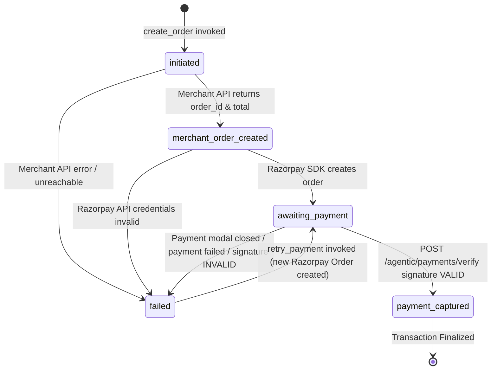

# Payment Flow

Complete technical specification of ShopAgent's Razorpay payment lifecycle, state machine, signature verification, retry mechanics, and transaction integrity guarantees.

## Related Documentation

- [Architecture](architecture.md)
- [Agentic Commerce](agentic-commerce.md)
- [Security & Guardrails](security-and-guardrails.md)
- [Failure Recovery](failure-recovery.md)
- [Merchant Integration](merchant-integration.md)
- [Custom Domains](custom-domains.md)
- [API Reference](api-reference.md)

---

## 1. Complete Payment Lifecycle (12 Steps)

```
[Customer Chat] "Yes, confirm order"
       ↓ (1. Customer confirmation)
[Agent Orchestrator] Dispatches create_order(address_id)
       ↓ (2. create_order execution)
[FastAPI Tool] Validates cart & snapshots unit prices
       ↓ (3. Live price validation)
[Merchant Backend] POST /orders → returns merchant_order_id & order_total
       ↓ (4. Merchant order creation)
[Razorpay API] rzp_client.order.create(amount_in_paise) → returns razorpay_order_id
       ↓ (5. Razorpay order creation)
[Storefront UI] Renders Razorpay Checkout modal (Key ID + Razorpay Order ID)
       ↓ (6. Payment checkout)
[Razorpay Modal] Customer completes payment via Card/UPI/Netbanking
       ↓ (7. Razorpay payment result)
[FastAPI Route] POST /agentic/payments/verify with signature, order_id, payment_id
       ↓ (8. Server-side signature verification)
[PostgreSQL DB] Updates AgentOrder.status = 'payment_captured'
       ↓ (9. AgentOrder update)
[Agent Orchestrator] Dynamic metadata hydration via hydrate_payment_metadata()
       ↓ (10. Payment metadata hydration)
[Background Task] Dispatches POST webhook (order.payment_completed) to Merchant API
       ↓ (11. Merchant notification/webhook)
[Completed State] UI renders green "Payment Captured" receipt card
       ↓ (12. Final transaction state)
```

---

## 2. Order Identifier Disambiguation

ShopAgent operates across three distinct system domains. To avoid confusion, four identifiers are maintained:

| Identifier Name | DB Field Name | Source System | Example Format | Purpose / Role |
|---|---|---|---|---|
| **ShopAgent Order ID** | `AgentOrder.id` | ShopAgent DB | `550e8400-e29b-41d4-a716-446655440000` (UUIDv4) | Primary internal tracking record; receipt reference in Razorpay notes. |
| **Merchant Order ID** | `AgentOrder.merchant_order_id` | Merchant API | `ORD-98214` or `m_550e8400` | Merchant's own order identifier in their e-commerce backend. |
| **Razorpay Order ID** | `AgentOrder.razorpay_order_id` | Razorpay API | `order_NqJ9Xz3kL8mP2Q` | Razorpay order reference created via Razorpay SDK `order.create()`. |
| **Razorpay Payment ID** | `AgentOrder.razorpay_payment_id` | Razorpay API | `pay_NqJABc4dE5fG6H` | Captured payment transaction reference provided upon successful charge. |

---

## 3. Payment State Machine

The payment status of an order is tracked in `AgentOrder.status` using the `AgentOrderStatus` string enumeration (`app/system/models.py`):



### State Definitions & Triggers

| State Enum | Raw String | Meaning & Trigger |
|---|---|---|
| `INITIATED` | `"initiated"` | Local `AgentOrder` row created in PostgreSQL as `create_order` starts. |
| `MERCHANT_ORDER_CREATED` | `"merchant_order_created"` | Merchant API successfully returned `merchant_order_id` and confirmed order. |
| `AWAITING_PAYMENT` | `"awaiting_payment"` | Razorpay order created (`order_...`); Razorpay Checkout button ready in UI. |
| `PAYMENT_CAPTURED` | `"payment_captured"` | Server-side HMAC SHA256 signature verified; payment fully captured. |
| `FAILED` | `"failed"` | Merchant API error, Razorpay failure, or signature mismatch. `failure_reason` recorded. |

---

## 4. Server-Side Signature Verification

Payment completion is **never trusted from the frontend alone**. When the customer completes payment in the Razorpay Checkout modal, the storefront posts the payment result to `/agentic/payments/verify`:

```python
# Code location: backend/app/agentic/routes/payment.py
msg_bytes = f"{payload.razorpay_order_id}|{payload.razorpay_payment_id}".encode("utf-8")
expected_signature = hmac.new(
    key=key_secret.encode("utf-8"),
    msg=msg_bytes,
    digestmod=hashlib.sha256
).hexdigest()

if not hmac.compare_digest(expected_signature, payload.razorpay_signature):
    raise HTTPException(status_code=400, detail="signature_verification_failed")
```

1. **HMAC Computation**: Calculates `HMAC-SHA256(razorpay_order_id + "|" + razorpay_payment_id, RAZORPAY_KEY_SECRET)`.
2. **Constant-Time Comparison**: Uses `hmac.compare_digest()` to prevent timing attacks.
3. **Database Capture**: On match, `AgentOrder.status` is updated to `payment_captured` and `razorpay_payment_id` is stored.
4. **Merchant Webhook Dispatch**: Spawns an asynchronous background task `send_merchant_webhook(event="order.payment_completed")`.

---

## 5. Payment Retry Mechanics (`retry_payment`)

When a payment fails or the customer closes the payment popup without paying, the order status remains `AWAITING_PAYMENT` or transitions to `FAILED`.

```
Customer: "Can I try paying again?"
       ↓
Gemini invokes retry_payment(agent_order_id)
       ↓
Backend queries AgentOrder in PostgreSQL
       ↓
┌─────────────────────────────────────────────────────────────┐
│ If status == "payment_captured":                            │
│   Return "already_completed" (Idempotent guard)              │
│                                                             │
│ If status == "awaiting_payment" with valid razorpay_order_id:│
│   Return existing razorpay_order_id & payment metadata       │
│                                                             │
│ If status == "failed" or missing razorpay_order_id:         │
│   REUSE existing merchant_order_id                           │
│   Invoke Razorpay API to create NEW razorpay_order_id        │
│   Update AgentOrder.status = "awaiting_payment"             │
└─────────────────────────────────────────────────────────────┘
       ↓
Return fresh Payment Checkout Card to customer
```

> [!IMPORTANT]
> `retry_payment` **never creates a new merchant order**. It reuses `merchant_order_id` and generates a new Razorpay order ID if the previous payment attempt failed, preventing duplicate inventory reservations on the merchant backend.

---

## 6. Verification & Test Suite

The payment subsystem is validated by automated unit tests in `backend/app/tests/`:

- `test_payment_verify.py`: Validates successful signature verification, status update to `payment_captured`, invalid signature rejection (HTTP 400), and non-existent order lookup rejection (HTTP 404).
- `test_razorpay_fail_loudly.py`: Verifies that missing Razorpay API credentials fail loudly with explicit log messages and update `AgentOrder.status` to `failed` rather than hanging.
- `test_merchant_verify_order.py`: Validates the server-to-server verification endpoint (`GET /merchant/orders/verify?merchant_order_id=...`) authenticated via API Key.

---

## 7. Consistency Considerations

> [!NOTE]
> ShopAgent does **not** claim atomic distributed transactions across Merchant API + Razorpay + PostgreSQL. The following distributed consistency characteristics apply:

1. **Merchant Order Created, Razorpay Order Creation Fails**: The merchant order exists on the merchant's backend, but payment cannot be initialized. `AgentOrder.status` is set to `FAILED` with `failure_reason = "razorpay_error: ..."`. The customer can use `retry_payment` to generate a Razorpay order against the existing `merchant_order_id`.
2. **Payment Captured, Merchant Webhook Fails**: Signature verification succeeds, and PostgreSQL marks `AgentOrder.status` as `payment_captured`. `send_merchant_webhook()` attempts 3 retries with exponential backoff. If the merchant endpoint remains down, the merchant can verify the order out-of-band via `GET /merchant/orders/verify?merchant_order_id=...` using their API Key.
3. **Cart Retention on Failure**: Customer cart items in PostgreSQL (`cart_items`) are **only cleared after** both merchant order creation and Razorpay order creation succeed. If merchant order placement fails, the cart remains intact.
