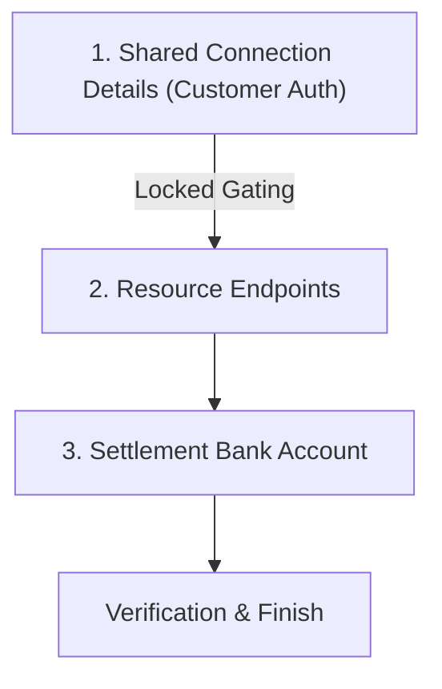

# Onboarding Flow Documentation

This document describes the unified onboarding configuration flow built in `frontend_main` used by merchants to connect their existing store databases, setup customer credentials authorization, and specify settlement bank accounts.

## Onboarding Structure

The onboarding process is presented on a single dashboard divided into three functional blocks:

---

## 1. Connection Details & Customer Authentication

This section configures the primary store base API coordinates and establishes how the AI agent identifies customers securely.

* **Draft Persistence**: As changes are made in Step 1, progress is automatically synced to `localStorage` (blob key `"onboarding_step1_draft"`). On page load, if no configuration is present in the database, progress is restored from the local draft. Once Step 1 is saved, the draft is cleared and database records become the single source of truth.
* **Gating Rules**: Step 2 remains locked and inaccessible until connection details have been successfully saved to the backend database via the **Save Connection Details** action.
* **Require Customer Authentication Toggle**: Enabled by default (ON).
  * **Toggle OFF Intervention**: Intercepted with a danger confirmation warning modal describing data safety implications (inability to resolve user identities, profiles, or purchase histories). Requires explicit merchant confirmation to proceed.
  * **When Enabled (ON)**: Reveals Auth URL and HTTP Method selection along with the **Map Login Fields** button launching a 4-step configuration wizard (Payload Mapping -> Test API -> Token Path Extraction -> Cookie/Header Token Delivery). Tested tokens are automatically cached for subsequent testing steps.

---

## 2. Resource Endpoints

Configure individual resource endpoint paths appended to the base URL and HTTP methods.

* **Token Reuse**: When testing resource endpoints, if customer authentication is enabled, the AI agent automatically attaches the active session token gathered during Step 1's test using the exact delivery method configured (header names + Bearer prefixes, or cookies).
* **Modal Configuration & Real Testing**: Replaced the inline row layout with simple resource cards. Clicking a resource card opens a scoped modal presenting input fields tailored specifically to that resource. Tooltips (Info icons) next to input fields provide inline operational context.
* **Save & Test Flow**: Modals end with a test action dispatching requests (using shared base URL + cached auth tokens) and presenting the fully formatted JSON response body with green/red status badges.

### Per-Resource Modal Specifications

a) **Products Search**:
   - GET path (default `/products`).
   - Payload key for query keywords (e.g. `query`).
   - Response key mapping products lists in the JSON response payload.

b) **Order History**:
   - GET path (default `/orders/history`).
   - Token-secured query, no search payload required.
   - Optional nested JSON response key mapping.

c) **Customer Profile**:
   - GET path (default `/customers`).
   - Token-secured, no payload.

d) **Addresses (Fetch & Create tabs)**:
   - **Fetch**: GET path (default `/addresses`) and optional nested results key.
   - **Create**: POST path (default `/addresses`). Free-form key list mapper specifying expected parameters (e.g. `line1, city, pincode`). Test panel prompts values for configured keys and posts address details.

e) **Create Order**:
   - POST path (default `/orders`).
   - Cart array wrapper key mapping (default `cart`) and exactly 3 item parameter fields (`item_id`, `price`, `quantity`). Tests send payloads structured as:
     `{ "<cart_key>": [ { "<item_id_field>": "...", "<price_field>": 0, "<quantity_field>": 1 } ] }`

---

## 3. Settlement Bank Account

Links deposit target coordinates for Razorpay payout distribution:
- **Bank Account Number**: Merchant deposit identifier.
- **IFSC Code**: Checked against Razorpay's public IFSC validation service:
  `GET https://ifsc.razorpay.com/{IFSC}`
- On successful resolution, the UI displays the verified **Bank Name** and **Branch Name** in an inline success badge.

---

## Completion Criteria

The **Finish Setup** action is enabled only when:
1. Shared connection details are saved to the database.
2. All 5 resource endpoints (Products, Order History, Customer Profile, Addresses, Create Order) have been configured and verified successfully.
3. The IFSC code lookup resolves successfully.
