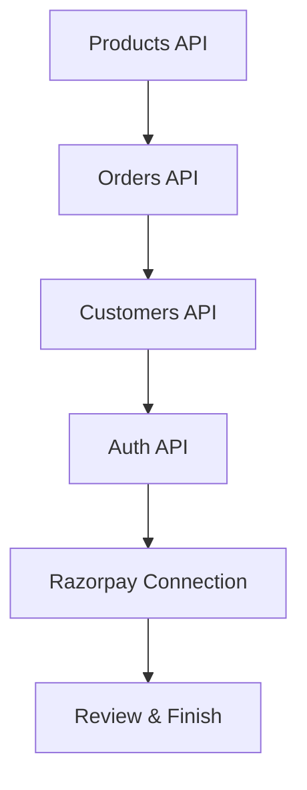

# Onboarding Flow Documentation

This document describes the multi-step API onboarding wizard built in `frontend_main` used by merchants to connect their existing store databases with the AI shopping agent platform.

## Wizard Structure

The wizard guides the merchant through connecting 4 essential business APIs and linking their Razorpay payout account.

---

### Step 1: Products API
- **Purpose**: Gives the AI shopping agent permissions to browse the store's inventory, query stock availability, and recommend items.
- **Fields**: Base URL, Auth Method (Select), Credential value.

### Step 2: Orders API
- **Purpose**: Allows the AI agent to verify purchase states, create cart payloads, and register transactions.
- **Fields**: Base URL, Auth Method (Select), Credential value.

### Step 3: Customers API
- **Purpose**: Retrieves customer loyalty metrics, addresses, and triggers custom discounts.
- **Fields**: Base URL, Auth Method (Select), Credential value.

### Step 4: Auth API
- **Purpose**: Secures user sign-ins inside the chatbot, scoping agent permissions.
- **Fields**: Base URL, Auth Method (Select), Credential value.

### Step 5: Settlement Bank Account Connection
- **Purpose**: Collects merchant bank routing targets to settle transaction payouts.
- **Verification**: Resolves IFSC code dynamically using Razorpay's validation API (`https://ifsc.razorpay.com`), showing Bank Name and Branch Name. Proceeding is allowed only if IFSC is successfully resolved.

---

## Connection Verification

Each step features a validation test.
- A step **cannot be skipped** or advanced until a successful verification (`success` status badge) is confirmed.
- Once all 5 connections return positive checkmarks, the final summary screen unlocks the **Finish Setup** action to redirect the merchant to the primary dashboard.
