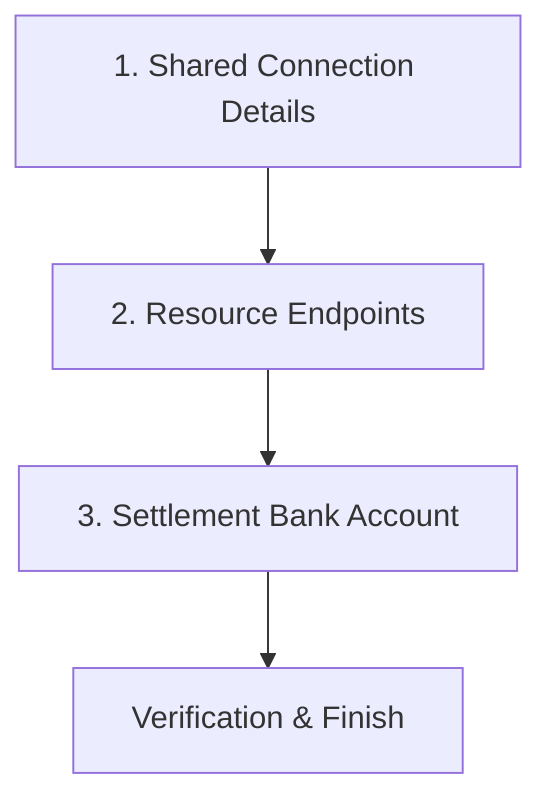

# Onboarding Flow Documentation

This document describes the unified, single-page onboarding configuration flow built in `frontend_main` used by merchants to connect their existing store databases and settlement bank accounts.

## Onboarding Structure

Instead of separate wizard steps, onboarding is presented on a single dashboard divided into three functional blocks:

---

## 1. Shared Connection Details

Entered once at the top of the page, these configuration credentials authorize all subsequent endpoint requests:
- **API Base URL**: e.g., `https://api.yourstore.com/v1`
- **Authentication Method**: Dropdown supporting `API Key`, `Bearer Token`, or `Basic Auth`.
- **Credential Value**: Key/Token string.

Changing any of these fields automatically resets the verification states of the 5 endpoint rows below.

---

## 2. Resource Endpoints

Configure individual paths appended to the shared Base URL and HTTP methods. Each endpoint features its own **Test** verification action.

| Endpoint | Default Path | Default Method | Description |
|---|---|---|---|
| **Products API** | `/products` | `GET` | Catalog item discovery and detail queries. |
| **Orders API** | `/orders` | `POST` | Order cart submission and registration. |
| **Customers API** | `/customers` | `GET` | Customer profiling and loyalty validation. |
| **Auth API** | `/auth` | `POST` | Secured shopper sign-ins and session scoping. |
| **Order History** | `/orders/history` | `GET` | Active shipping updates and purchase history. |

---

## 3. Settlement Bank Account

Links deposit target coordinates for Razorpay payout distribution:
- **Bank Account Number**: Merchant deposit identifier.
- **IFSC Code**: Checked against Razorpay's public IFSC validation service:
  `GET https://ifsc.razorpay.com/{IFSC}`
- On successful resolution, the UI displays the verified **Bank Name** and **Branch Name** in an inline success badge.

---

## Completion Criteria

The **Finish Setup** action is enabled only when:
1. Shared connection details are not empty.
2. All 5 resource endpoints return positive verified `success` badges.
3. The IFSC code lookup resolves successfully.
